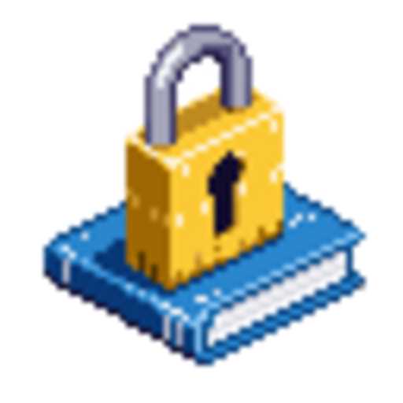

<div align="center">



# CryptoGest

**ERP de Gestion Contable y Financiera**

Software de escritorio para la gestion integral de contabilidad, facturacion y fiscalidad.
Cifrado de extremo a extremo. Tus datos nunca salen de tu equipo sin tu autorizacion.

[](https://github.com/tu-usuario/cryptogest/releases)
[](#instalacion)
[](#seguridad)
[](LICENSE)

---

[Caracteristicas](#caracteristicas) &#8226; [Seguridad](#seguridad) &#8226; [Instalacion](#instalacion) &#8226; [Stack Tecnologico](#stack-tecnologico) &#8226; [Desarrollo](#desarrollo) &#8226; [Licencia](#licencia)

</div>

<br/>

## Por que CryptoGest

CryptoGest nace de una premisa clara: **la informacion financiera de tu empresa debe ser privada, segura y estar bajo tu control**. A diferencia de soluciones en la nube donde tus datos residen en servidores de terceros, CryptoGest almacena todo localmente en tu equipo con cifrado de grado militar.

- **Privacidad por diseno** -- Tus datos financieros nunca abandonan tu dispositivo sin autorizacion explicita.
- **Sin suscripciones obligatorias** -- Software de escritorio que funciona sin conexion a internet.
- **Cumplimiento fiscal espanol** -- Modelos 303, 111 y 390 integrados. Plan General de Contabilidad (PGC).
- **Multi-empresa** -- Gestiona multiples negocios desde una sola instalacion con aislamiento total de datos.

<br/>

## Caracteristicas

### Gestion Financiera Completa

| Modulo | Descripcion |
|--------|-------------|
| **Dashboard** | Vision general con KPIs en tiempo real: clientes activos, ingresos, facturas pendientes, gastos y balance neto. |
| **Facturacion** | Ciclo completo de facturas: borrador, emitida, pagada, vencida y anulada. Lineas con impuestos y retenciones automaticas. |
| **Gastos** | Registro de gastos con categorias, adjuntos cifrados y soporte para importacion masiva desde CSV. |
| **Clientes** | Base de datos de clientes con NIF, datos de contacto, historial de actividad y estado. |
| **Productos y Servicios** | Catalogo con precios base, configuracion fiscal (IVA, IRPF, RE) y estado activo/inactivo. |

### Contabilidad y Fiscalidad

| Modulo | Descripcion |
|--------|-------------|
| **Asientos Contables** | Partida doble con generacion automatica desde facturas y gastos. Validacion de cuadre debe/haber. |
| **Plan de Cuentas** | Estructura jerarquica basada en el PGC con cuentas del sistema y cuentas personalizables. |
| **Ejercicios Fiscales** | Gestion de periodos fiscales con apertura, cierre y estadisticas por ejercicio. |
| **Libro Mayor** | Consulta de movimientos por cuenta contable con saldos acumulados. |
| **Modelo 303** | Liquidacion trimestral de IVA con desglose de IVA devengado y deducible. |
| **Modelo 111** | Declaracion trimestral de retenciones e ingresos a cuenta del IRPF. |
| **Modelo 390** | Resumen anual de IVA con conciliacion completa del ejercicio. |

### Multi-Empresa

- Crea y gestiona **multiples empresas** de forma independiente.
- Cada empresa dispone de su **propia base de datos**, credenciales y directorio de archivos.
- Almacenamiento en **rutas personalizadas**: unidades USB, discos de red o cualquier ubicacion.
- Cambio rapido entre empresas desde el selector integrado.

### Respaldos y Exportacion

- **Backup local** comprimido con un clic.
- **Backup en la nube** cifrado con seguimiento de progreso y gestion de cuota.
- **Exportacion a Excel** de facturas, gastos y datos financieros.
- **Importacion CSV** para carga masiva de gastos.
- Restauracion completa desde archivos de respaldo.

<br/>

## Seguridad

La seguridad no es una funcion adicional en CryptoGest; es el fundamento sobre el que se construye toda la aplicacion.

### Cifrado de Datos

| Componente | Especificacion |
|------------|----------------|
| **Algoritmo** | AES-256-GCM (cifrado autenticado) |
| **Derivacion de clave** | PBKDF2 con 100,000 iteraciones |
| **Salt** | 256 bits (32 bytes), unico por empresa |
| **Vector de inicializacion** | 128 bits (16 bytes), unico por operacion |
| **Tag de autenticacion** | 128 bits (16 bytes) |

### Autenticacion

- **Contrasena maestra** con requisitos minimos de seguridad.
- **PIN numerico** (4-8 digitos) como metodo alternativo.
- **Passkeys biometricos** -- Windows Hello, Touch ID o autenticacion del sistema.
- **Bloqueo automatico** de sesion por inactividad.

### Arquitectura Segura

- **Aislamiento de procesos**: el proceso de renderizado no tiene acceso directo al sistema de archivos ni a Node.js.
- **API de lista blanca**: solo las operaciones explicitamente definidas en el puente IPC estan disponibles.
- **Adjuntos cifrados**: los archivos adjuntos se almacenan con nombres aleatorios y cifrado AES-256-GCM.
- **Credenciales protegidas**: las passkeys se almacenan mediante `Electron safeStorage`, vinculado al sistema operativo.
- **Base de datos local**: SQLite embebido, sin servidores externos obligatorios.

<br/>

## Instalacion

### Requisitos del sistema

- **Windows** 10/11 (x64)
- **macOS** 12 Monterey o superior
- **Linux** distribuciones basadas en Debian/Ubuntu, Fedora o Arch

### Descargar

Descarga la ultima version desde la [pagina de Releases](https://github.com/tu-usuario/cryptogest/releases):

| Plataforma | Formato |
|------------|---------|
| Windows | `.exe` (instalador) |
| macOS | `.dmg` |
| Linux | `.AppImage` |

### Primer inicio

1. Ejecuta el instalador correspondiente a tu sistema operativo.
2. Al abrir la aplicacion, el **asistente de configuracion** te guiara para crear tu primera empresa.
3. Establece tu contrasena maestra o PIN.
4. Comienza a gestionar tu contabilidad.

<br/>

## Stack Tecnologico

| Capa | Tecnologias |
|------|-------------|
| **Aplicacion** | [Electron](https://www.electronjs.org/) 27 |
| **Frontend** | [React](https://react.dev/) 18, [TypeScript](https://www.typescriptlang.org/) 5.3 |
| **Estilos** | [Tailwind CSS](https://tailwindcss.com/) 3.4, [Radix UI](https://www.radix-ui.com/) |
| **Base de datos** | [SQLite](https://www.sqlite.org/) con [Prisma](https://www.prisma.io/) ORM 5.7 |
| **Criptografia** | Node.js Crypto (AES-256-GCM, PBKDF2) |
| **Build** | [Vite](https://vitejs.dev/) 5, [Electron Builder](https://www.electron.build/) |

<br/>

## Desarrollo

### Requisitos previos

- [Node.js](https://nodejs.org/) >= 18
- [npm](https://www.npmjs.com/) >= 9

### Configuracion del entorno

```bash
# Clonar el repositorio
git clone https://github.com/tu-usuario/cryptogest.git
cd cryptogest

# Instalar dependencias
npm install

# Generar el cliente de Prisma
npm run prisma:generate

# Ejecutar migraciones de base de datos
npm run prisma:migrate

# Iniciar en modo desarrollo
npm run dev
```

### Scripts disponibles

| Comando | Descripcion |
|---------|-------------|
| `npm run dev` | Inicia la aplicacion en modo desarrollo con recarga en caliente. |
| `npm run build` | Compila y empaqueta la aplicacion para todas las plataformas. |
| `npm run build:win` | Genera el instalador para Windows. |
| `npm run build:mac` | Genera el instalador para macOS. |
| `npm run build:linux` | Genera el instalador para Linux. |
| `npm run prisma:studio` | Abre Prisma Studio para inspeccion visual de la base de datos. |

### Estructura del proyecto

```
cryptogest/
├── src/                    # Frontend (React + TypeScript)
│   ├── pages/              # Paginas de la aplicacion
│   ├── components/         # Componentes reutilizables
│   │   ├── layout/         # Layout principal y sidebar
│   │   └── ui/             # Componentes de interfaz (shadcn/ui)
│   └── lib/                # Utilidades
├── electron/               # Proceso principal de Electron
│   ├── main.ts             # Logica del servidor, IPC handlers
│   ├── preload.ts          # Puente seguro renderer ↔ main
│   ├── crypto.ts           # Cifrado y gestion multi-empresa
│   └── cloud.ts            # Integracion con servicio de backup en la nube
├── prisma/                 # Esquema y migraciones de base de datos
│   └── schema.prisma       # 14 modelos de datos
└── assets/                 # Recursos estaticos
```

<br/>

## Licencia

Este proyecto se distribuye bajo la licencia [ISC](LICENSE).

---

<div align="center">

**CryptoGest** -- Gestion contable segura y profesional.

</div>
